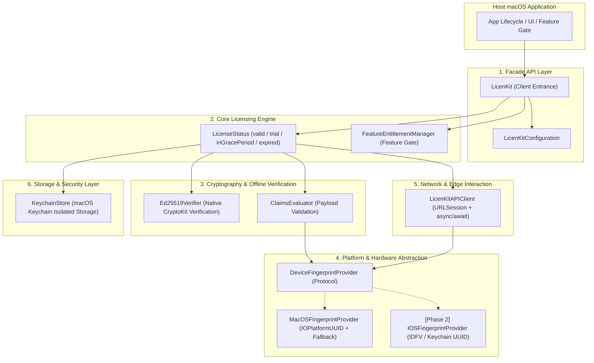
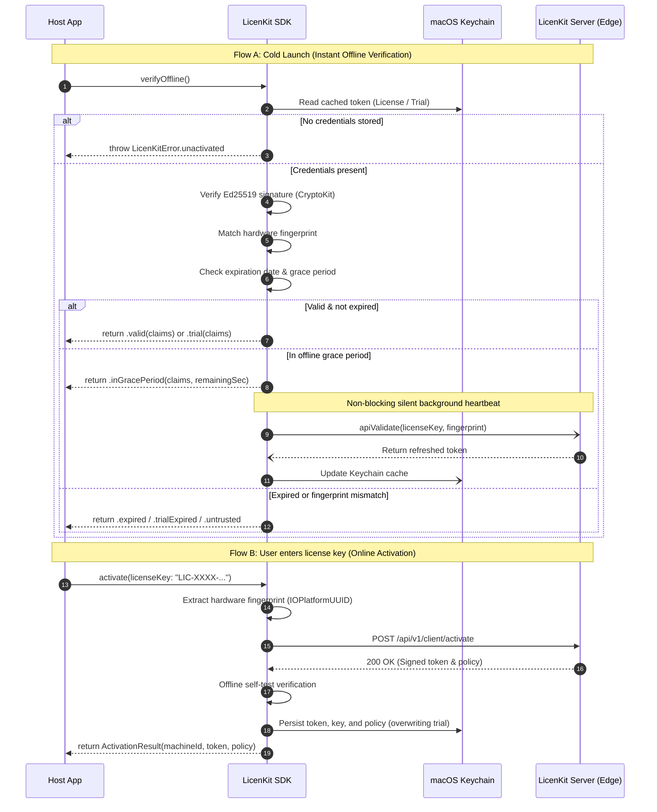

# LicenKit Swift SDK Architecture & Security Specification

**English** | [简体中文](zh-CN/ARCHITECTURE.md)

This document details the software architecture, security model, offline cryptography, and platform adaptation mechanisms of the **LicenKit Swift SDK** (`licenkit-sdk-swift`).

---

## 1. Architectural Vision & Principles

The LicenKit Swift SDK is engineered for commercial Apple platforms, adhering to these core principles:

1. **Zero External Dependencies**: Built 100% on Apple system libraries (`Foundation`, `CryptoKit`, `Security`, `IOKit`). Eliminates supply chain risks, minimizes binary bloat, and guarantees full compliance with App Store guidelines.
2. **Headless & UI-Agnostic**: Focused purely on business contracts and APIs, avoiding any tight coupling with UI frameworks (SwiftUI/AppKit), offering host applications complete aesthetic flexibility.
3. **Dual-Mode Verification**:
   - **0ms Cold-Start Check**: Offline Ed25519 signature and hardware fingerprint evaluation via CryptoKit with 0 network latency;
   - **Resilient Background Heartbeats**: Silent, non-blocking online status refresh and token renewal during offline grace periods.
4. **Seamless Free Trial**: Frictionless device-level trial claiming, issuance of offline `LK-TRIAL` tokens, and smooth upgrade transitions to commercial licenses upon purchase.
5. **Kernel-Grade Hardware Anti-Abuse**: Leverages OS kernel-level hardware identifiers to prevent license key leaks, multi-machine cloning, and seat abuse.
6. **Multi-Platform Preparedness**: First-phase targets macOS desktop, with modular abstractions that allow future expansion into iOS and iPadOS.

---

## 2. System Layering

The SDK is organized into high-cohesion, low-coupling layers:



---

## 3. Core Mechanisms

### 3.1 Dual-Mode Verification Workflow

LicenKit combines offline cryptographic checks with edge synchronization:



### 3.2 Offline Token Cryptography

Tokens follow a lightweight, standard three-part Base64URL structure:
```text
Header.Payload.Signature
```

1. **Header**:
   ```json
   { "alg": "Ed25519", "typ": "LK-TOKEN", "kid": "key_prod_01" }
   ```
   (For trial tokens, `typ` is `"LK-TRIAL"`)

2. **Payload (Claims)**:
   - Commercial License Claims:
     ```json
     {
       "typ": "license",
       "lic_id": "lic_99a8b7c6",
       "sub": "LIC-ABCD-1234-EFGH-5678",
       "acc": "acc_licenkit_team",
       "prd": "prd_mac_editor",
       "pol": "pol_pro_lifetime",
       "fp": "A3D16E04-209F-5BC7-99E3-4E80D6955E09",
       "iat": 1726574400,
       "exp": 1758110400,
       "fea": ["4k_export", "gpu_acceleration", "batch_convert"]
     }
     ```
   - Free Trial Claims:
     ```json
     {
       "typ": "trial",
       "acc": "acc_licenkit_team",
       "prd": "prd_mac_editor",
       "fp": "A3D16E04-209F-5BC7-99E3-4E80D6955E09",
       "iat": 1726574400,
       "exp": 1727784000,
       "fea": ["4k_export", "gpu_acceleration"]
     }
     ```

3. **Signature**:
   - 64-byte Ed25519 signature generated by the server's private key over `HeaderB64Url.PayloadB64Url`.
   - Verified locally using `CryptoKit.Curve25519.Signing.PublicKey`.

### 3.3 macOS Hardware Fingerprinting & Anti-Abuse

1. **Primary Path (Kernel IOKit Query)**:
   - Queries `IOPlatformExpertDevice` via CoreFoundation / IOKit C APIs;
   - Retrieves `kIOPlatformUUIDKey` (motherboard hardware UUID);
   - Zero-overhead, no sub-process invocation, stable across OS updates.
2. **Deterministic Fallback**:
   - In sandboxed environments where `IOPlatformUUID` is restricted, enumerates physical network interface MAC addresses and hostname;
   - Computes a deterministic SHA-256 hash as an immutable device fingerprint.

### 3.4 Keychain Credential Storage

- **No Plaintext Files**: Never saves activation keys or tokens in `UserDefaults` or plaintext plists.
- **Keychain Isolation**:
  - Based on `kSecClassGenericPassword`;
  - Service scoped to `com.licenkit.client.<productId>`;
  - Accessible attribute `kSecAttrAccessibleAfterFirstUnlock` for background Daemons;
  - Supports iCloud Keychain roaming for seamless multi-device activation under the same Apple ID.

---

## 4. Multi-Platform Extensibility (macOS -> iOS)

The SDK architecture is designed for multi-platform readiness:

1. **Protocol Abstraction**:
   ```swift
   public protocol DeviceFingerprintProvider: Sendable {
       func getFingerprint() async throws -> String
   }
   ```
2. **Compile-time Isolation**:
   - macOS-specific `import IOKit` is contained strictly within `#if os(macOS)`;
   - Future iOS extensions implement `IOSFingerprintProvider` using `UIDevice.current.identifierForVendor` and Keychain UUID;
   - Crypto, models, network client, and licensing state machines are 100% platform-agnostic and shared across all targets.

---

## 5. High Availability & Disaster Recovery Architecture

For detailed specifications on fault taxonomy (HTTP 404, 5xx, network loss), multi-tier offline grace periods, jittered exponential backoff, and transparent fallback mechanisms, please refer to:
* 📖 [**LicenKit Client High Availability & Disaster Recovery Specification**](FAULT_TOLERANCE_AND_DISASTER_RECOVERY.md)
