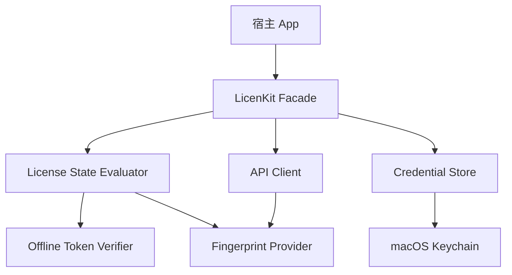

# Swift SDK 架构与安全边界

## 1. 模块


```mermaid
flowchart TD
    Host[宿主 App] --> Facade[LicenKit Facade]
    Facade --> State[License State Evaluator]
    Facade --> Network[API Client]
    Facade --> Storage[Credential Store]
    State --> Crypto[Offline Token Verifier]
    State --> Device[Fingerprint Provider]
    Network --> Device
    Storage --> Keychain[macOS Keychain]
```

- **Facade**：公开 async API，不包含 UI；
- **State Evaluator**：组合本地凭据、时间和服务端结果；
- **API Client**：激活、验证和解绑；
- **Offline Token Verifier**：只处理 `signed_offline`；
- **Credential Store**：保存设备凭据，不保存服务端 Secret；
- **Fingerprint Provider**：提供稳定设备指纹。

## 2. 信任模型

### 在线模式

授权事实来自一次成功的 HTTPS 服务端验证。Machine Token 只证明调用方持有该 Activation 的随机凭证，本身不包含可离线验证的权益。

网络不可用时，SDK可以返回最近验证时间和缓存条款，但不能返回“离线验签成功”。宿主 App 是否短时间继续运行，需要显式配置或自行判断。

### 签名离线模式

授权事实来自服务端私钥签名的 Offline Token。SDK 使用 App 内置的受信公钥验证：

- Token 完整性；
- account 和 product；
- License 和 Activation；
- 设备指纹；
- Token 与 License 有效期；
- 功能权益。

从授权服务运行时下载的公钥不能自动成为信任根，否则攻击者同时替换服务地址和公钥即可绕过验证。

## 3. 激活状态流

```text
unactivated
   │ activate
   ├── online response ─────────> validOnline
   └── signed_offline response
         │ verify signature
         ├── success ───────────> validOffline
         └── failure ───────────> untrusted / configuration error
```

服务端返回 `signed_offline` 但缺少 Token、key ID 或受信公钥时必须失败，不能降级成在线成功。

## 4. 本地检查

`checkLocalStatus` 按本地凭据中的 verification mode 分支：

- 在线模式：读取最近在线状态，返回 `validOnline`、`temporarilyUnverified` 或 `onlineValidationRequired`；
- 签名离线模式：验证 Offline Token，返回 `validOffline`、`expired` 或 `untrusted`。

SDK 不使用一个统一的 `verifyOffline` 名称覆盖两种模式，因为在线凭据不具备离线验证能力。

## 5. 凭据存储

Keychain 记录按 account + product + fingerprint 隔离：

- Activation ID；
- Machine Token；
- verification mode；
- Offline Token，可为空；
- last validated at；
- 缓存权益摘要。

注册码用于建立 Activation，成功后默认丢弃。它不写入普通文件、UserDefaults 或 iCloud Keychain。

## 6. 密钥轮换

SDK 接受 key ID 到公钥的集合：

- 新 Token 使用 active key；
- 未过期旧 Token 可以继续由 retired key 验证；
- revoked key 应导致对应 Token 不再受信；
- 移除旧公钥前必须确保所有由它签发的 Token 已经过期。

## 7. 网络与错误

网络失败、服务端 5xx 和业务拒绝分开表达：

- 网络失败不等于 License revoked；
- `LICENSE_SUSPENDED`、`LICENSE_EXPIRED`、`ACTIVATION_REVOKED` 等业务码进入对应状态；
- 未知服务端错误保留 code、message、details 和 request ID；
- Keychain OSStatus、签名错误和 JSON 解码错误保留原始诊断。

## 8. 解绑

解绑先调用远端，再清理本地凭据：

1. 服务端成功：清理本地，返回 completed；
2. 服务端明确表示 Activation 已不存在：视为幂等成功，清理本地；
3. 网络或服务端暂时失败：保留凭据并返回 remote failure；
4. 宿主 App 如果提供“仅清理本地”操作，必须使用不同名称并说明远端席位可能仍被占用。

## 9. 不在 SDK 内实现

- 支付和订阅管理；
- 注册码邮件找回；
- 管理控制台；
- License Terms 迁移；
- 隐式 UI 弹窗；
- 自动信任运行时下载的公钥。
