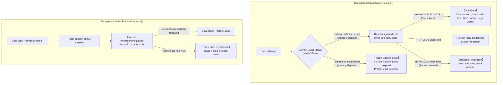

# LicenKit Client High Availability & Disaster Recovery Specification

**English** | [简体中文](zh-CN/FAULT_TOLERANCE_AND_DISASTER_RECOVERY.md)

This document specifies the high-availability disaster recovery architecture, dual-track retry strategy, and Fail-Silent degradation mechanisms for **LicenKit** under unstable network conditions, server outages (e.g., HTTP 404, 500, 502, 503, 504), and offline environments.

---

## 1. Core Principles & Philosophy

Software licensing systems operate across heterogeneous and unpredictable end-user network environments. Timeouts, firewall blocks, DNS resolution failures, reverse proxy issues, and server maintenance are inevitable realities. LicenKit adheres to the following foundational guidelines:

### 1.1 Principle 1: Fail-Silent on Network/Infra, Fail-Closed on Revocation
* **Business Continuity First**: Legitimate paying customers must never be locked out or interrupted due to server downtime or transient network interruptions.
* **Separation of Concerns**:
  * **Transport & Infrastructure Faults (timeouts, network drops, 5xx, gateway errors)**: Execute a **Fail-Silent** policy. If local cryptographic status is currently valid, silently swallow transport exceptions and retain usable status with zero UI disruption.
  * **Explicit Business Revocation (chargebacks, explicit license deletion, seat unbinding)**: Execute a **Fail-Closed** policy, transitioning status to `.untrusted` and terminating access.

### 1.2 Principle 2: Local Cryptographic Sovereignty
* **Decentralized Verification**: LicenKit is architected around **Ed25519 asymmetric cryptographic signatures** and **self-contained Claims Tokens**.
* **Local State Authority**: The primary state (`cachedStatus`) is governed by local public-key cryptography, hardware fingerprint matching, and timestamp constraints.
* **No Pseudo-State Synthesis**: When a license is definitively expired locally (`.expired`), the SDK **never** falsely manufactures validity because the server returned a 5xx error. An expired license remains expired until legitimately renewed.

### 1.3 Principle 3: Strict Separation of Transport Codes vs. Business Outcomes
* **Payload Dictates Business Status**:
  * On `/validate` endpoints, the server returns HTTP `200 OK` with structured JSON payloads (`data.valid: false` and `reason`) to express business revoking.
  * Non-2xx HTTP status codes (gateway 404, WAF 403, proxy 502/503, server 500) are purely **transport and infrastructure errors** and are never treated as business revocations.

### 1.4 Principle 4: Dual API Architecture (Silent Sync vs. User-Initiated Renewal)
* **Background Silent Sync (`validate()`)**: Executed after app launch in the background. Employs `backgroundSync` retry logic and Fail-Silent semantics; silent on failure.
* **Foreground User-Initiated Renewal (`refresh()`)**: Executed when user taps "Refresh License / Check Renewal" in UI. Resets circuit breaker, applies `foregroundActivation` retry logic, and provides explicit success/failure feedback to UI.

---

## 2. Error Taxonomy & Resilience Matrix

| Failure Type | Symptoms & HTTP Status | Root Nature | When Local Status is Valid | When Local Status is Expired | Effect on Credentials |
| :--- | :--- | :--- | :--- | :--- | :--- |
| **Internal Server Error** | HTTP `500 Internal Server Error` | Edge engine or database fault | **Fail-Silent**: Retain valid status silently | **Remain `.expired`**: No fake validity | **Never clear**; retain credentials |
| **Gateway & Proxy Outage** | HTTP `502 / 503 / 504` | Proxy down, deploy in progress, gateway timeout | **Fail-Silent**: Retain valid status silently | **Remain `.expired`**: No fake validity | **Never clear**; retain credentials |
| **Unstructured Gateway 404** | HTTP `404 Not Found` (HTML page or proxy error) | Route misconfigured or Base URL invalid | **Fail-Silent**: Retain valid status silently | **Remain `.expired`**: No fake validity | **Never clear**; retain credentials |
| **WAF / Captive Portal 403** | HTTP `403 Forbidden` (Cloudflare WAF / Hotel Wi-Fi portal) | Transport restricted, not business revocation | **Fail-Silent**: Retain valid status silently | **Remain `.expired`**: Prompt user to check Wi-Fi | **Never clear**; retain credentials |
| **Client Physical Offline** | No network, airplane mode, unplugged cable | Transport unreachable (user network environment) | **Fail-Silent**: Retain valid status silently | **Remain `.expired`**: Prompt to connect to internet | **Never clear**; wait for re-connect |
| **Explicit Business Revocation** | HTTP `200` (`data.valid == false`) or structured code | Administrator unpinned machine, license deleted | **Explicit business failure**: Set `.untrusted` | **Explicit business failure**: Set `.untrusted` | **Mark untrusted / clear seat** |
| **Active Deactivation** | Caller invokes `deactivate()` | User initiates sign-out / device release | **Local-first**: Immediately purge locally | **Local-first**: Immediately purge locally | **Immediately purged** |

---

## 3. Dual-Track Retry Specification

To avoid thundering herd storms (DDoS) against the server and UI freezes, retries are strictly bifurcated by request type:

| Dimension | Track A: Foreground Blocking (`activate` / `refresh`) | Track B: Background Silent (`validate`) |
| :--- | :--- | :--- |
| **Typical Context** | User inputs license key, taps "Refresh License" | Silent startup verification, periodic background sync |
| **UI & Psychology** | Loading spinner on modal; user tolerance is ~10-15s | **Completely silent**; user is actively working in the app |
| **Recoverable 5xx & Timeouts** | **Up to 3 retries** Backoff: **2s $\rightarrow$ 4s $\rightarrow$ 8s** (+ light jitter) | **Max 1 retry (2 attempts total)** Wait **$\ge 60$s** before 2nd attempt; if still failing, **abandon retries for this session** |
| **Rate Limiting (429)** | **Up to 3 retries** Backoff: **4s $\rightarrow$ 8s $\rightarrow$ 16s** | **Immediately abort, stop for the rest of the day** Persist cooldown timestamp (`rateLimitedUntil`), skip sync for 24h |
| **Business Rejections (valid == false)** | **0 retries**, fail immediately and display reason | **0 retries**, mark license invalid (`.untrusted`) |
| **Terminal Outcome** | Throw explicit network error for UI alert/toast | **Fail-Silent**: Retain usable status; or remain expired |

---

## 4. Gating Flow

---

## 5. Security Safeguards

* **Clock Rollback Defense**: If current system time $T_{\text{now}} < T_{\text{lastValidated}} - 3600\text{s}$, the SDK marks the state as `.untrusted` to prevent users from artificially resetting their system clock to prolong grace periods.
* **Hardware Pinning**: Offline fallback requires hardware fingerprint matching against claims embedded in the token, preventing unauthorized credential portability.
