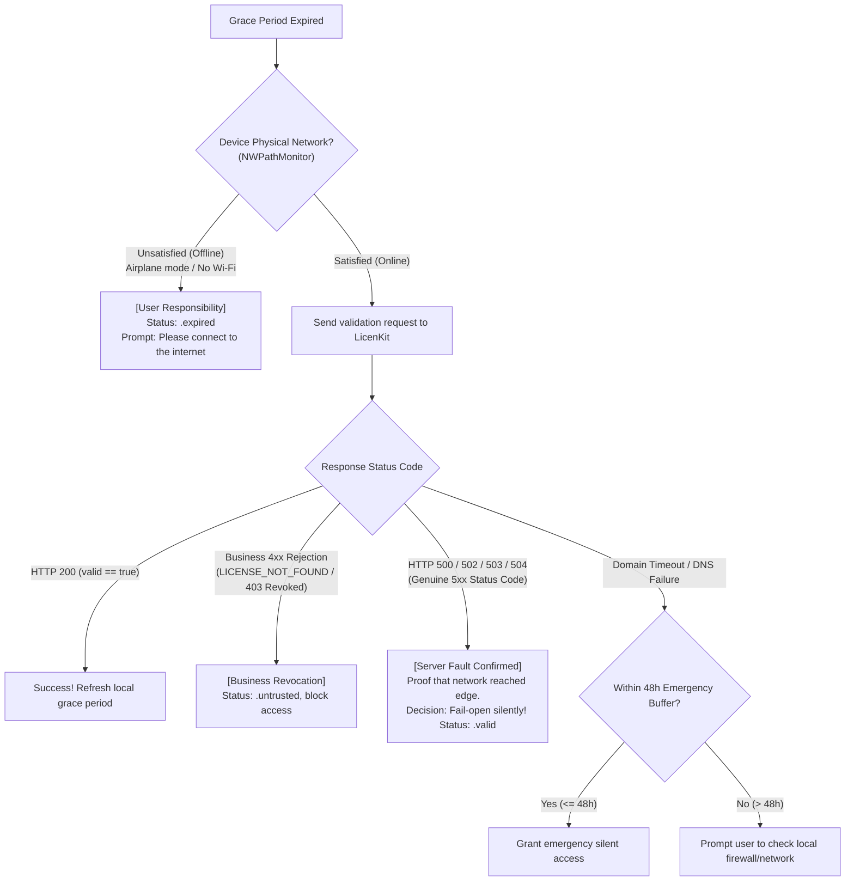

# LicenKit Client High Availability & Disaster Recovery Specification

**English** | [简体中文](zh-CN/FAULT_TOLERANCE_AND_DISASTER_RECOVERY.md)

This document specifies the high-availability disaster recovery architecture, dual-track retry strategy, and graceful degradation mechanisms for **LicenKit** under unstable network conditions, server outages (e.g., HTTP 404, 500, 502, 503, 504), and offline environments.

---

## 1. Core Principles & Philosophy

Software licensing systems operate across heterogeneous and unpredictable end-user network environments. Timeouts, firewall blocks, DNS resolution failures, reverse proxy issues, and server maintenance are inevitable realities. LicenKit adheres to the following foundational guidelines:

### 1.1 Principle 1: Fail-Open on Infrastructure, Fail-Closed on Revocation
* **Business Continuity First**: Legitimate paying customers must never be locked out or interrupted due to server downtime or transient network interruptions.
* **Separation of Concerns**:
  * **Infrastructure Failures (5xx, timeouts, gateway errors)**: Execute a **Fail-Open** policy, maintaining full application access within the configured offline grace period.
  * **Explicit Business Revocation (chargebacks, explicit deletions, seat revoking)**: Execute a **Fail-Closed** policy, terminating access and clearing credentials as required.

### 1.2 Principle 2: Blame-Aware Gating on Grace Expiration
**"Never punish legitimate paying customers for server-side infrastructure faults."**  
Even when the local offline grace period has fully expired, the SDK does NOT indiscriminately block the user. It evaluates responsibility based on network status and server responses:
* **Attributed to User (Device physically offline)**:
  Device is in airplane mode or disconnected from Wi-Fi beyond the grace period. The SDK displays a friendly notice: *"Offline grace period exceeded. Please connect to the internet to verify your license."* Users anticipate and accept this behavior.
* **Attributed to Server (Device online, but server returns 5xx)**:
  **Receiving HTTP 500/502/503/504 proves the request reached the edge and our server failed.** Legitimate users must not be penalized. **The SDK remains completely silent and fails open**, allowing continued full access.

### 1.3 Principle 3: Offline-First Cryptographic Autonomy
* **Decentralized Verification**: LicenKit is architected around **Ed25519 asymmetric cryptographic signatures** and **self-contained Claims Tokens**.
* **Local Sovereignty**: Clients persist trusted tokens in Keychain. Cold-starts and routine feature gating rely exclusively on local public-key cryptography (< 1ms), treating the network purely as a synchronization channel.

### 1.4 Principle 4: Strict Error Bifurcation
The SDK cleanly distinguishes between:
1. **Transport & Infrastructure Errors**: Network unreachable, DNS failure, request timeout, HTTP 5xx, or non-API gateway 404s;
2. **Explicit Business Rejection**: Structured JSON responses containing canonical error codes (e.g., `LICENSE_NOT_FOUND`, `MACHINE_REVOKED`) or `valid: false`.

---

## 2. Error Taxonomy & Resilience Matrix

| Failure Type | Symptoms & HTTP Status | Root Nature | Within Grace Period | After Grace Expiration | Effect on Credentials |
| :--- | :--- | :--- | :--- | :--- | :--- |
| **Internal Server Error** | HTTP `500 Internal Server Error` | Edge engine or database fault | **Offline fallback**: Verify token & grant access | **[Server Fault] Fail-Open**: Continue silent access | **Never clear**; retain credentials |
| **Gateway & Proxy Outage** | HTTP `502 / 503 / 504` | Proxy down, deploy in progress, gateway timeout | **Offline fallback**: Grant access; schedule retry | **[Server Fault] Fail-Open**: Continue silent access | **Never clear**; retain credentials |
| **Unstructured Gateway 404** | HTTP `404 Not Found` (HTML page or proxy error) | Route misconfigured or Base URL invalid | **Treated as infrastructure error**: Grant access | **[Config Error] Fail-Open**: Log warning | **Never clear**; retain credentials |
| **Client Physical Offline** | No network, airplane mode, unplugged cable | Transport unreachable (user network environment) | **Offline fallback**: Grant access | **[User Responsibility] State `.expired`**: Prompt to connect to internet | **Never clear**; wait for re-connect |
| **Transient Link Flapping** | Device online, but domain unreachable | Intermediate route jitter or local firewall block | **Offline fallback**: Grant access | **Emergency 48h buffer**: Silent access before warning | **Never clear**; retain credentials |
| **Business-Level 404** | HTTP `404 / 422` (JSON `code: "LICENSE_NOT_FOUND"`) | License key was purged or deleted on server | **Explicit business failure**: Terminate access | **Explicit business failure**: Terminate access | **Mark revoked / Clear credentials** |
| **Machine Seat Revoked** | HTTP `200` (`valid: false`) or `code: "MACHINE_DEACTIVATED"` | Administrator revoked device seat from dashboard | **Explicit business failure**: Terminate access | **Explicit business failure**: Terminate access | **Mark revoked / Clear credentials** |
| **Active Deactivation** | Caller invokes `deactivate()` | User initiates sign-out / device release | **Local-first**: Immediately purge locally | **Local-first**: Immediately purge locally | **Immediately purged** |

---

## 3. Dual-Track Retry Specification

To avoid thundering herd storms (DDoS) against the server and UI freezes, retries are strictly bifurcated by request type:

| Dimension | Track A: Foreground Blocking (`activate`) | Track B: Background Silent (`validate` / Heartbeat) |
| :--- | :--- | :--- |
| **Typical Context** | User inputs license key, clicks "Restore License" | Silent startup verification, periodic background sync |
| **UI & Psychology** | Loading spinner on modal; user tolerance is ~10-15s | **Completely silent**; user is actively working in the app |
| **Recoverable 5xx & Timeouts** | **Up to 3 retries** Backoff: **2s $\rightarrow$ 4s $\rightarrow$ 8s** (+ light jitter) | **Max 1 retry (2 attempts total)** Wait **$\ge 60$s** before 2nd attempt; if still failing, **abandon retries for this session** |
| **Rate Limiting (429)** | **Up to 3 retries** Backoff: **4s $\rightarrow$ 8s $\rightarrow$ 16s** (rare on Cloudflare) | **Immediately abort, stop for the rest of the day** Persist cooldown timestamp (`rateLimitedUntil`), skip sync for 24h |
| **Business Rejections (404/409)** | **0 retries**, fail immediately and display reason | **0 retries**, mark license invalid |
| **Terminal Outcome** | Display clear error modal with "Retry" button | **Seamless fallback** to local `verifyOffline()`; zero disruption |

---

## 4. Gating Flow on Grace Period Expiration

---

## 5. Security Safeguards

* **Clock Rollback Defense**: If current system time $T_{\text{now}} < T_{\text{lastValidated}} - 3600\text{s}$, the SDK marks the state as `.untrusted` to prevent users from artificially resetting their system clock to prolong grace periods.
* **Hardware Pinning**: Offline fallback requires hardware fingerprint matching against claims embedded in the token, preventing unauthorized credential portability.
