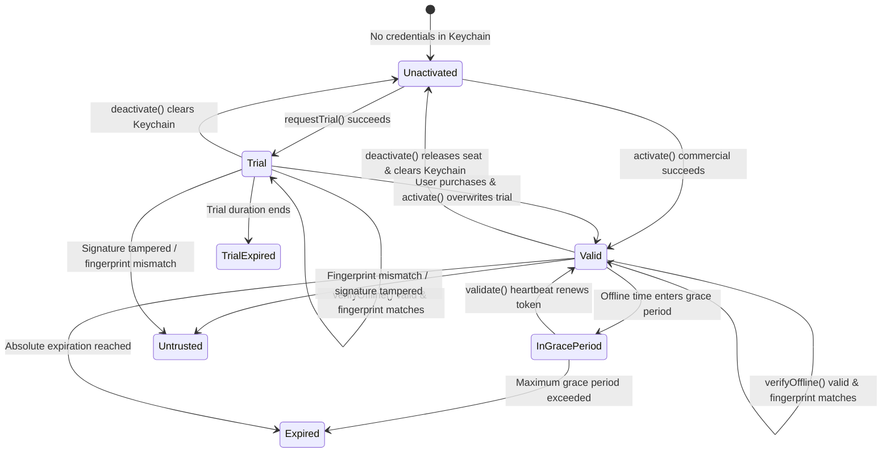

# LicenKit Swift SDK Modules & Features Specification

**English** | [简体中文](zh-CN/MODULES_AND_FEATURES.md)

This document defines the architectural boundaries, responsibilities, data structures, and internal interactions of all modules in the **LicenKit Swift SDK** (`licenkit-sdk-swift`).

> [!NOTE]
> **Scope**: This SDK follows a **Headless (API-only)** design pattern. It contains no embedded UI, modals, or dialogs, offering pure, strongly typed, thread-safe licensing primitives.

---

## Module Overview

| Module Name | Path | Responsibilities & Highlights | Dependencies |
| :--- | :--- | :--- | :--- |
| **Facade & Client** | `Sources/LicenKit/` | Global singleton, entry points, lifecycle orchestration, public APIs | `Foundation` |
| **Crypto Core** | `Sources/LicenKit/Crypto/` | Ed25519 signature verification, Base64URL codec, token claim evaluation | `CryptoKit` |
| **Platform Device** | `Sources/LicenKit/Platform/` | Hardware fingerprinting, macOS IOKit `IOPlatformUUID` & fallback | `IOKit` (macOS only) |
| **Network Client** | `Sources/LicenKit/Network/` | Asynchronous communication with LicenKit Edge APIs (`URLSession`) | `Foundation` |
| **Storage & Security** | `Sources/LicenKit/Storage/` | Secure credential persistence, Keychain isolation, iCloud sync | `Security` |
| **Models & Errors** | `Sources/LicenKit/Models/` | State machine enums, token claim models, error types | `Foundation` |

---

## 1. Module 1: Client Facade & Configuration

### 1.1 Responsibilities
- Single unified entry point for host applications.
- Manages runtime context (immutable configuration, in-memory license status caching, background heartbeat tasks).
- Manages dependency injection for underlying modules.

### 1.2 Core Types & Data Flow
- `LicenKitConfiguration`: Immutable configuration struct.
  - `serverUrl`: Base URL of the LicenKit deployment.
  - `accountId`: Account / Workspace identifier.
  - `productId`: Product identifier.
  - `publicKey`: Ed25519 public key (Raw 32-byte Base64 or standard SPKI).
  - `timeoutInterval`: Network request timeout in seconds.
- `LicenKit`: Public facade class conforming to Swift Concurrency (`Sendable`).

---

## 2. Module 2: Crypto Core & Offline Verification

### 2.1 Responsibilities
- Native, zero-dependency Ed25519 elliptic curve signature verification.
- Parses three-segment JWT-like license & trial tokens (`Header.Payload.Signature`).
- Evaluates offline business rules (expiration checks, fingerprint matching, feature entitlement evaluation, clock rollback defense).

### 2.2 Core Components
1. **`Ed25519Verifier`**:
   - Supports both raw 32-byte Base64 and standard SPKI public keys.
   - `verifyAndDecodeAnyToken`: Verifies mathematical signature first, then adapts to `LicenseClaims` or `TrialClaims`.
2. **`ClaimsEvaluator`**:
   - `evaluate(claims:...)`: Evaluates commercial licenses, grace periods, and clock skew.
   - `evaluateTrial(claims:...)`: Evaluates trial validity, expiration, and fingerprint matching.

---

## 3. Module 3: Platform & Device Fingerprinting

### 3.1 Responsibilities
- Extracts immutable hardware attributes to stop license sharing across machines.
- Provides macOS native extraction with deterministic fallback.

### 3.2 macOS Native Logic (`MacOSFingerprintProvider`)
1. **Kernel IOKit Query**:
   ```text
   IOServiceMatching("IOPlatformExpertDevice")
   -> IORegistryEntryCreateCFProperty(kIOPlatformUUIDKey)
   -> Formatted standard UUID string
   ```
2. **Deterministic Network Fallback**:
   - When IOKit is sandboxed, enumerates physical network MAC addresses + Hostname;
   - Computes a stable `CryptoKit.SHA256` digest as a deterministic device fingerprint.

---

## 4. Module 4: Network & Edge API Client

### 4.1 Responsibilities
- Modern asynchronous networking client based on `URLSession`.
- Strict adherence to the LicenKit RESTful contract.
- Unified handling of network errors, timeouts, and HTTP status code mappings.

### 4.2 Endpoint Mapping

| Action | Path | Method | Key Parameters | Response |
| :--- | :--- | :--- | :--- | :--- |
| **Claim Trial** | `/api/v1/client/trial` | `POST` | `account_id`, `product_id`, `fingerprint` | Claim status, signed token, features |
| **Activate Seat** | `/api/v1/client/activate` | `POST` | `account_id`, `license_key`, `fingerprint`, `platform` | Seat ID, signed token, policy |
| **Validate Heartbeat** | `/api/v1/client/validate` | `POST` | `account_id`, `license_key`, `fingerprint` | Validity, renewed token, expiration |
| **Deactivate Seat** | `/api/v1/client/deactivate` | `POST` | `account_id`, `license_key`, `fingerprint` | Deactivation confirmation |
| **Fetch Public Key** | `/api/v1/client/products/:id/pubkey` | `GET` | `accountId` (Query) | Active public key, algorithm, kid |

---

## 5. Module 5: Storage & Keychain Security

### 5.1 Responsibilities
- Securely persists sensitive credentials:
  - User license key (`license_key`);
  - Offline verification token (`token`);
  - Last successful validation timestamp and offline grace period;
  - Trial flag (`isTrial`).
- Prevents tampering via plaintext plists or JSON files.

### 5.2 Security Mechanisms (`KeychainStore`)
- Built on Apple's **Keychain Services** (`kSecClassGenericPassword`);
- Service scoped to `com.licenkit.client.<productId>`;
- `kSecAttrAccessibleAfterFirstUnlock` ensures background read access;
- Supports iCloud Keychain roaming for automatic multi-device restoration.

---

## 6. Module 6: License State Machine



- **`valid(claims: LicenseClaims)`**: Commercial license is active and fully verified.
- **`trial(claims: TrialClaims)`**: Free trial is active and within valid duration.
- **`inGracePeriod(claims: LicenseClaims, remainingSeconds: TimeInterval)`**: Offline grace period active; app may operate while prompting silent background validation.
- **`expired`**: Commercial license expired.
- **`trialExpired`**: Free trial period ended.
- **`untrusted(reason: String)`**: Tampering detected, signature invalid, or hardware fingerprint mismatch.
- **`unactivated`**: No license or trial credentials present.
