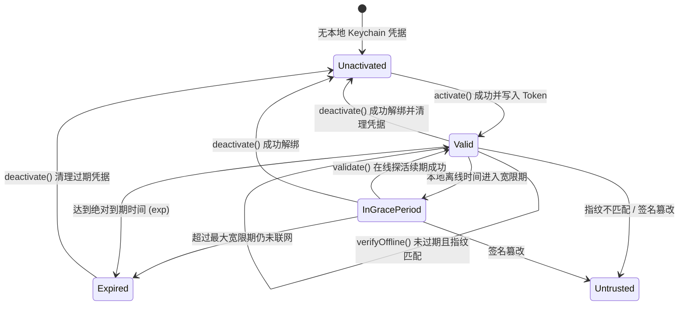

# LicenKit Swift SDK 功能与模块设计规范

本文档面向工程开发与 SDK 维护者，详细定义 **LicenKit Swift SDK** (`licenkit-sdk-swift`) 各功能模块的职责边界、数据结构以及内部交互逻辑。

> [!NOTE]
> **设计范围界定**：本 SDK 一期采用 **Headless（纯无界面 API）** 设计原则，不包含任何内置 UI 界面或弹窗视图，仅提供纯粹、强类型、线程安全的底层能力与业务状态接口。

---

## 模块全景图

| 模块名称 | 所在目录 | 职责与核心特性 | 依赖库 |
| :--- | :--- | :--- | :--- |
| **Facade & Client** | `Sources/LicenKit/` | 全局单例/多实例入口、生命周期调度、对外公开 API | `Foundation` |
| **Crypto Core** | `Sources/LicenKit/Crypto/` | Ed25519 签名验证、Base64URL 编解码、Token 业务判定 | `CryptoKit` |
| **Platform Device** | `Sources/LicenKit/Platform/` | 硬件特征抽象、macOS IOKit `IOPlatformUUID` 提取与回退 | `IOKit` (仅 macOS) |
| **Network Client** | `Sources/LicenKit/Network/` | 与 LicenKit 服务端边缘 API 通信 (`URLSession`) | `Foundation` |
| **Storage & Security** | `Sources/LicenKit/Storage/` | 本地安全凭据存储、Keychain 隔离与持久化 | `Security` |
| **Models & Errors** | `Sources/LicenKit/Models/` | 状态机枚举、Token Claims 模型、错误码分类 | `Foundation` |

---

## 1. 模块 1：Client Facade & Configuration

### 1.1 职责
- 作为宿主应用接入 SDK 的唯一入口。
- 维护客户端运行时上下文（配置项、当前内存中的验证状态缓存、后台静默心跳任务）。
- 协同管理各底层子模块的依赖注入。

### 1.2 核心类型与数据流
- `LicenKitConfiguration`：不可变配置结构体。
  - `serverUrl`: LicenKit 服务端边缘实例基础地址。
  - `accountId`: 商户/工作区唯一识别码。
  - `productId`: 软件产品 ID。
  - `publicKey`: 产品的 Ed25519 公钥（支持 32 字节原始 Base64 或 SPKI 格式）。
  - `offlineGracePeriodSeconds`: 客户端脱网宽限期（默认使用策略下发的周期，亦可配置本地保底时限）。
- `LicenKit`：公开门面类，遵循 Swift Concurrency 线程安全标准（`@MainActor` 或 `actor` / `Sendable`）。

---

## 2. 模块 2：Crypto Core & 离线密码学

### 2.1 职责
- 实现纯离线、零外部依赖的 Ed25519 椭圆曲线数字签名验证。
- 解析 JWT-like 三段式结构的 License Token (`Header.Payload.Signature`)。
- 执行离线业务规则判定（有效期校验、机器指纹比对、特性权限过滤）。

### 2.2 核心组件
1. **`Ed25519Verifier`**：
   - 兼容两种公钥输入格式：
     - Raw 32-Byte Base64；
     - Standard SPKI PEM / DER 格式（去除头尾并解析 32 字节裸公钥）。
   - 将 `HeaderB64Url.PayloadB64Url` 转为 UTF-8 字节流，并将 Base64URL 签名转为 64 字节二进制数据。
   - 调用 `CryptoKit.Curve25519.Signing.PublicKey(rawRepresentation:)` 执行 `isValidSignature(_:for:)`，完成纯脱网数学核验。
2. **`ClaimsEvaluator`**：
   - 提取 Payload 中的字段：
     - `sub`：授权码 (License Key)；
     - `exp`：过期时间戳；
     - `fp`：绑定的硬件指纹；
     - `fea`：授权特性列表 (Features)。
   - 对照本地时间与当前设备硬件指纹，输出判定结论（有效 / 宽限期 / 已过期 / 指纹不符）。

---

## 3. 模块 3：Platform & Device Fingerprint (硬件指纹)

### 3.1 职责
- 提取宿主机器不可篡改的全局唯一硬件特征，杜绝 License 扩散。
- 建立多端隔离架构，一期提供完整的 macOS 原生硬件指纹提取与高可用回退。

### 3.2 macOS 原生提取逻辑 (`MacOSFingerprintProvider`)
1. **主选通道（内核 IOKit 原生属性）**：
   ```text
   IOServiceMatching("IOPlatformExpertDevice")
   -> IORegistryEntryCreateCFProperty(kIOPlatformUUIDKey)
   -> CFString 转换并格式化为标准 UUID 字符串
   ```
   - **特点**：速度极快（<1ms），无子进程开销，沙盒兼容性极佳。
2. **安全降级回退（Deterministic Network Fallback）**：
   - 若 IOKit 因极端沙盒策略被拦截，通过 `getifaddrs` 读取设备非回环物理网卡的 MAC 地址；
   - 组合 `Hostname + Platform + MAC Addresses`；
   - 执行 `CryptoKit.SHA256` 计算哈希摘要并格式化为十六进制字符串，确保指纹始终稳定一致。

---

## 4. 模块 4：Network & Cloudflare API 交互

### 4.1 职责
- 封装基于 `URLSession` 的现代异步网络客户端。
- 严格遵从 LicenKit 服务端 RESTful API 契约协议。
- 统一处理网络错误、超时、重试与 HTTP 状态码映射。

### 4.2 接口对接矩阵

| API 动作 | 请求路径 | 方法 | 核心参数 | 响应数据 |
| :--- | :--- | :--- | :--- | :--- |
| **激活席位** | `/api/v1/client/activate` | `POST` | `account_id`, `license_key`, `fingerprint`, `platform` | 席位 ID、签名 Token、策略信息 |
| **心跳探活** | `/api/v1/client/validate` | `POST` | `account_id`, `license_key`, `fingerprint` | 是否有效、最新 Token、过期时间 |
| **解绑席位** | `/api/v1/client/deactivate` | `POST` | `account_id`, `license_key`, `fingerprint` | 解绑确认状态 |
| **拉取公钥** | `/api/v1/client/products/:id/pubkey` | `GET` | `accountId` (Query) | 产品活跃公钥、算法、Key ID |

---

## 5. 模块 5：Storage & Keychain 安全持久化

### 5.1 职责
- 安全持久化授权核心资产，包括：
  - 用户的激活码 (`license_key`)；
  - 服务端下发的签名凭据 (`license_token`)；
  - 上次成功校验时间戳与离线宽限期元数据。
- 杜绝本地用户修改文件系统（如 Plist、JSON）伪造授权。

### 5.2 安全机制 (`KeychainStore`)
- 使用 Apple 系统级 **Keychain Services** (`SecItemAdd`, `SecItemUpdate`, `SecItemCopyMatching`)。
- 账户与产品隔离：
  - `kSecAttrService` = `"com.licenkit.client.<productId>"`；
  - `kSecAttrAccount` = `"active_license_credentials"`。
- 当调用 `deactivate()` 时，触发原子操作清空 Keychain 对应条目。

---

## 6. 模块 6：运行态许可证状态机 (License State Machine)

SDK 内部维护明确的状态迁移逻辑，提供强类型枚举 `LicenseStatus`：



- **`valid(claims: LicenseClaims)`**：完全有效，所有授权功能正常开放。
- **`inGracePeriod(claims: LicenseClaims, remainingSeconds: TimeInterval)`**：脱网宽限期中，允许用户离线使用，同时提示应用可在后台静默探活。
- **`expired`**：授权已终止，业务层需拦截核心功能并引导续订。
- **`untrusted(reason: String)`**：凭据存在签名损坏、硬件指纹跨机器篡改等安全异常。
- **`unactivated`**：本地尚未录入任何激活凭据。
