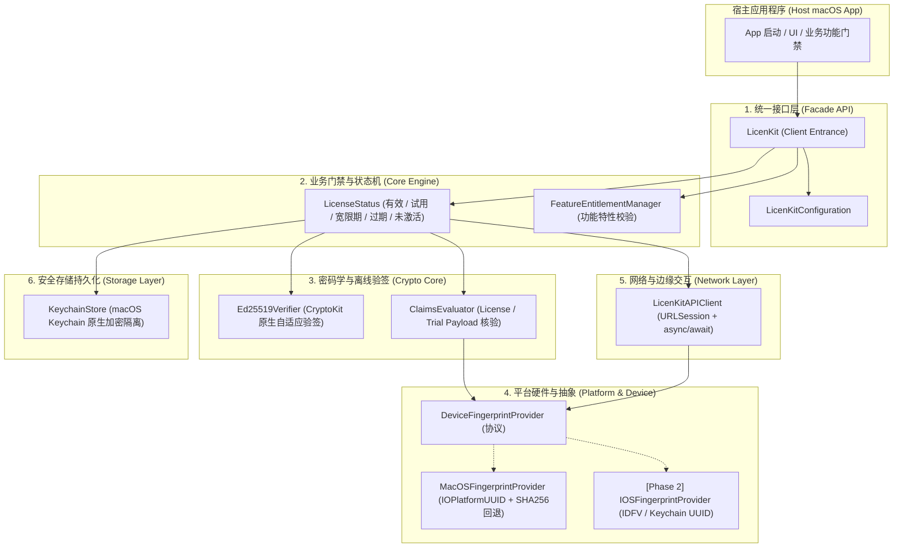
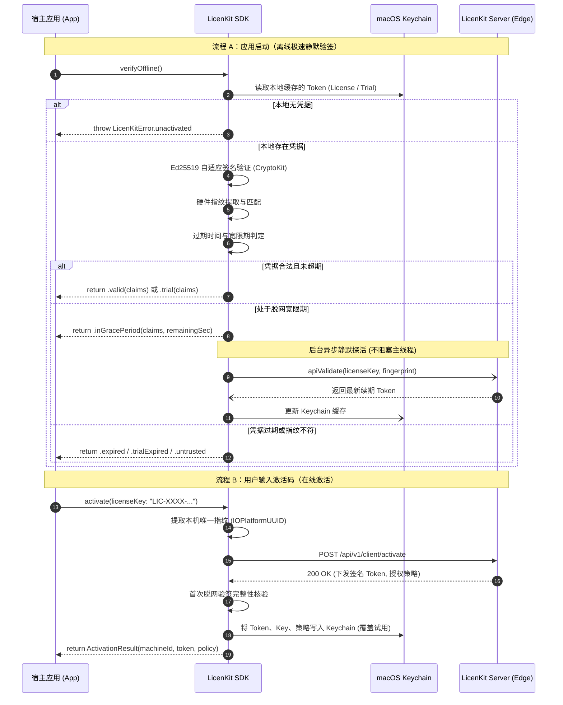

# LicenKit Swift SDK 架构设计与安全规范

[English](../ARCHITECTURE.md) | **简体中文**

本文档详述 **LicenKit Swift SDK** (`licenkit-sdk-swift`) 的整体技术架构、安全设计、离线密码学校验以及平台适配机制。

---

## 1. 架构愿景与设计原则

LicenKit Swift SDK 专为商业级 macOS 软件及 Apple 生态应用打造，遵循以下核心设计原则：

1. **零第三方外部依赖 (Zero External Dependencies)**：纯基于 Apple 官方系统库（`Foundation`、`CryptoKit`、`Security`、`IOKit`），确保无构建供应链隐患、零二进制体积负担、100% 满足 App Store 审核规范。
2. **纯接口先行，无侵入无 UI 绑定 (Headless & UI-Agnostic)**：一期聚焦于纯接口层（Headless API），不捆绑任何 SwiftUI/AppKit 弹窗或视图逻辑，赋予宿主应用最大的自由度，便于集成到各类不同风格的 macOS 商业软件中。
3. **双模校验与极致低延迟 (Dual-Mode Verification)**：
   - **冷启动 0 毫秒感知**：本地利用 CryptoKit + Ed25519 离线数学验签快速进入主流程；
   - **后台弹性心跳探活**：在宽限期内自动静默探活更新 License Token。
4. **免密试用平滑升级 (Seamless Free Trial)**：支持硬件指纹一键申领试用，签发 `LK-TRIAL` Token 脱网验签，与商业正式授权使用统一的底层校验管线与 Keychain 存储。
5. **硬核硬件防扩散 (Hardware Anti-Abuse)**：基于操作系统内核层唯一硬件指纹，有效抵御跨机器拷贝、注册码多机共享等滥用场景。
6. **为多端扩展预留架构 (Multi-Platform Preparedness)**：一期聚焦 macOS 桌面实现，同时在代码与协议设计上采用抽象隔离模式，确保未来无缝平滑扩展至 iOS、iPadOS。

---

## 2. 系统整体分层架构

SDK 内部按照高内聚、低耦合的分层架构组织：



---

## 3. 核心机制设计

### 3.1 双模校验模型 (Dual-Mode Verification)

LicenKit 提供“**脱网离线数学验签**”与“**联网在线探活同步**”双重保障：



### 3.2 离线 Token 密码学规范

离线 Token 遵循轻量安全的 JWT-like 三段式 Base64URL 结构：
```text
Header.Payload.Signature
```

1. **Header**：
   ```json
   { "alg": "Ed25519", "typ": "LK-TOKEN", "kid": "key_prod_01" }
   ```
   （试用版 Token 的 `typ` 对应为 `"LK-TRIAL"`）

2. **Payload (Claims)**：
   - 商业版 Claims:
     ```json
     {
       "typ": "license",
       "lic_id": "lic_99a8b7c6",
       "sub": "LIC-ABCD-1234-EFGH-5678",
       "acc": "acc_licenkit_team",
       "prd": "prd_mac_editor",
       "pol": "pol_pro_lifetime",
       "fp": "A3D16E04-209F-5BC7-99E3-4E80D6955E09",
       "iat": 1726574400,
       "exp": 1758110400,
       "fea": ["4k_export", "gpu_acceleration", "batch_convert"]
     }
     ```
   - 试用版 Claims:
     ```json
     {
       "typ": "trial",
       "acc": "acc_licenkit_team",
       "prd": "prd_mac_editor",
       "fp": "A3D16E04-209F-5BC7-99E3-4E80D6955E09",
       "iat": 1726574400,
       "exp": 1727784000,
       "fea": ["4k_export", "gpu_acceleration"]
     }
     ```

3. **Signature**：
   - 由服务端私钥对 `HeaderB64Url.PayloadB64Url` 执行 Ed25519 生成的 64 字节原生数字签名。
   - SDK 本地利用 `CryptoKit.Curve25519.Signing.PublicKey` 原生验签，支持纯 Base64 或标准 SPKI 格式的 32 字节产品公钥。

### 3.3 macOS 硬件指纹提取机理与反滥用

硬件绑定的安全性直接决定了离线 License 是否能防止“一码多拷”：
1. **优先路径 (Kernel IOKit 原生查询)**：
   - 通过 CoreFoundation / IOKit C API 查询 `IOPlatformExpertDevice`；
   - 提取系统全局唯一的 `kIOPlatformUUIDKey`（主板硬件 UUID）；
   - **优势**：纯系统级 C API 极速调用，无需启动子进程，格式标准，系统升级与重装依然保持稳定。
2. **安全降级回退 (Deterministic Fallback)**：
   - 若处于极端环境或沙盒受限无法读取 `IOPlatformUUID`，自动枚举物理网络接口 MAC 地址与 Hostname；
   - 经按序排序后计算 SHA-256 哈希作为稳定指纹，确保在任何环境下均能输出确定性、唯一的设备标识。

### 3.4 Keychain 安全凭据存储模型

- **拒绝明文文件**：坚决不在 `UserDefaults` 或 `~/Library/Application Support` 中以明文保存激活状态或解密密钥。
- **macOS Keychain 隔离**：
  - 基于 `kSecClassGenericPassword` 原生存储；
  - `kSecAttrService` 绑定至 `com.licenkit.client.<productId>`，保证不同产品间的授权凭据安全隔离；
  - `kSecAttrAccessible` 设置为 `kSecAttrAccessibleAfterFirstUnlock`，保证应用在开机后台静默运行时也能正常读取凭据；
  - 支持 iCloud Keychain 漫游激活码同步，同 Apple ID 多设备支持无感恢复激活。

---

## 4. 跨平台扩展性架构 (macOS -> iOS)

虽然一期只交付 macOS 实现，但架构已完成跨平台解耦：

1. **指纹提供器协议抽象**：
   ```swift
   public protocol DeviceFingerprintProvider: Sendable {
       func getFingerprint() async throws -> String
   }
   ```
2. **编译期条件隔离 (Compile-time Platform Isolation)**：
   - macOS 专有的 `import IOKit` 严格封闭在 `#if os(macOS)` 内；
   - 二期扩展 iOS 时，只需补充实现 `#if os(iOS)` 的 `IOSFingerprintProvider`（基于 `UIDevice.current.identifierForVendor` + Keychain 设备标识）；
   - 核心验签（CryptoKit）、状态机（LicenseStatus）、API 网络客户端（URLSession）等公共逻辑 100% 共享，实现无缝演进。

---

## 5. 高可用与容灾降级架构

有关面对网络不稳定、服务端 5xx、网关 404 等极端场景下的具体容灾矩阵、离线宽限期判定、防惊群退避算法与详细落地规范，请参阅专门文档：
* 📖 [**LicenKit 客户端高可用与异常容灾架构设计规范**](FAULT_TOLERANCE_AND_DISASTER_RECOVERY.md)
