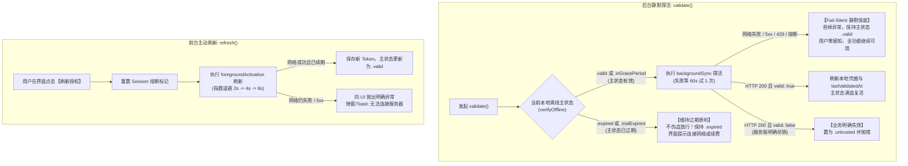

# LicenKit 客户端高可用与异常容灾架构设计规范

[English](../FAULT_TOLERANCE_AND_DISASTER_RECOVERY.md) | **简体中文**

本文档面向商业软件架构师与 SDK 集成开发者，详述 **LicenKit** 授权体系在面对网络不稳定、服务端故障（如 HTTP 404、500、502、503、504）及断网离线等各类极端场景下的高可用容灾架构、双轨重试策略与 Fail-Silent 静默保底机制。

---

## 1. 核心设计哲学与基本准则

软件授权系统运行在复杂的终端用户网络环境中。网络超时、弱网、DNS 解析失败、反向代理故障或服务端停机维护是不可避免的客观规律。为此，LicenKit 确立了以下核心容灾准则：

### 1.1 准则一：网络故障静默保底，业务吊销严格封禁 (Fail-Silent on Network/Infra, Fail-Closed on Revocation)
* **商业连续性第一**：绝对不能因为授权服务端故障或临时网络中断，导致正版付费用户被中断业务、锁死功能或弹出强阻断警报。
* **分权治理**：
  * **传输与基础设施故障（超时、断网、5xx、网关异常）**：采取 **Fail-Silent（静默保底）** 机制。若本地主状态当前有效，静默吞掉网络异常，维持当前可用状态，用户零感知，业务不中断；
  * **显式业务吊销（明确判定已退款、已过期、席位已解绑）**：采取 **Fail-Closed（严格封锁）** 机制，及时将本地状态置为 `.untrusted` 并终止授权。

### 1.2 准则二：本地离线密码学主状态是唯一权威 (Local Cryptographic Sovereignty)
* **状态不搞“精神分裂”**：
  * 本地主状态（`cachedStatus`）由 **Ed25519 签名验证**、**硬件指纹防伪比对** 以及 **时间约束判定** 唯一确定。
  * 后台网络探活是“辅助状态同步”机制，只能在服务端成功返回合法新 Token 时顺延本地有效期；
  * 当本地主状态已处于明确过期（`.expired`）时，**绝不因为服务端 5xx 反向伪造“放行”状态**；过期就是过期，界面正常引导续费。

### 1.3 准则三：业务判决与传输状态彻底隔离 (Separation of Transport vs Business Errors)
* **探活成功与否由 HTTP 200 报文体决定**：
  * 在 `/validate` 探活心跳接口中，服务端通过 HTTP `200 OK` 配合 Payload (`data.valid = false` 与 `reason`) 返回业务判决（如 `LICENSE_INVALID_OR_REVOKED`）；
  * 任何非 2xx HTTP 状态码（如网关 404、WAF 403、反向代理 502/503、服务端 500）均属于**网络与基础设施故障**，绝不被误判为“业务吊销”。

### 1.4 准则四：后台静默探活与前台主动刷新权责分离 (Dual API Architecture)
* **后台静默探活 (`validate()`)**：应用冷启动进入主界面后在后台调用，执行 `backgroundSync` 静默重试，遵守 Fail-Silent，网络失败不弹窗、不报错；
* **前台主动刷新 (`refresh()`)**：用户在已过期提示或设置界面点击【已续费，立即刷新】时调用，重置熔断并执行 `foregroundActivation` 前台重试，向用户清晰反馈网络成功或失败提示。

---

## 2. 异常分类与容灾判定矩阵

| 状态类型 | 具体现象与 HTTP 表现 | 异常根因性质 | 本地主状态有效时处理策略 | 本地主状态过期时处理策略 | 对本地凭据的影响 |
| :--- | :--- | :--- | :--- | :--- | :--- |
| **服务端内部错误** | HTTP `500 Internal Server Error` | 服务端边缘引擎或数据库异常 | **Fail-Silent**：保持主状态可用，静默忽略 | **维持 `.expired`**，拒绝伪造放行 | **严禁清除**，保留凭据 |
| **网关与负载均衡故障** | HTTP `502 / 503 / 504` | 代理层宕机、服务重启或网关超时 | **Fail-Silent**：保持主状态可用，静默忽略 | **维持 `.expired`**，拒绝伪造放行 | **严禁清除**，保留凭据 |
| **非结构化网关 404** | HTTP `404 Not Found`<br>(返回 HTML 页面或 Nginx 默认页) | 域名解析错误、Base URL 配置错误或网关路由故障 | **视为基础设施异常**：Fail-Silent 静默保底 | **维持 `.expired`**，拒绝伪造放行 | **严禁清除**，保留凭据 |
| **WAF / 登录页拦截 403** | HTTP `403 Forbidden`<br>(Cloudflare WAF / 酒店 Wi-Fi 网页拦截) | 网络传输层受限，非业务明确拒绝 | **视为网络异常**：Fail-Silent 静默保底 | **维持 `.expired`**，拒绝伪造放行 | **严禁清除**，保留凭据 |
| **客户端物理断网** | 系统无可用网络、飞行模式、网线拔出 | 传输层不可达（用户端网络环境） | **Fail-Silent**：保持主状态可用，静默等待连网 | **维持 `.expired`**，提示用户连接互联网 | **严禁清除**，保留凭据 |
| **服务端明确业务吊销** | HTTP `200` (`data.valid == false`) 或标准 JSON 拒绝码 | 管理员在后台解绑机器、许可证被退款废弃 | **显式业务失效**：状态置为 `.untrusted`，阻断功能 | **显式业务失效**：状态置为 `.untrusted`，阻断功能 | **标记失效 / 清除凭据** |
| **主动解绑席位** | 开发者或用户调用 `deactivate()` | 用户主动退出登录或注销当前设备 | **本地优先**：本地立即清除，向云端 Best-Effort 通知 | **本地优先**：本地立即清除，向云端 Best-Effort 通知 | **立即物理清除** |

---

## 3. “双轨制”容灾重试策略规范

针对不同交互属性的请求，SDK 实行严格分轨的退避重试机制，杜绝“全量教条式重试”带来的惊群效应（Thundering Herd / DDoS）与 UI 假死。

| 维度 | 轨道 A：前台阻塞操作 (`activate` / `refresh`) | 轨道 B：后台静默操作 (`validate`) |
| :--- | :--- | :--- |
| **典型场景** | 用户手动输入激活码、点击【立即刷新/检查续费】 | 应用启动时静默探活、定时后台打卡同步 |
| **界面与心理** | 前台弹窗带有 Loading 转圈，用户耐心在 10~15 秒以内 | **完全静默无感**，用户在主界面正常编辑或工作 |
| **可恢复故障 (5xx) & 超时** | **自动重试 3 次**<br>退避间隔：**2s $\rightarrow$ 4s $\rightarrow$ 8s**（注入轻微抖动） | **最多重试 1 次（共 2 次请求）**<br>第 1 次失败后，**静默等待 $\ge 60$ 秒**再试第 2 次；若仍失败，**本次打开/本 Session 彻底放弃重试** |
| **服务端限流 (429)** | **自动重试 3 次**<br>退避间隔：**4s $\rightarrow$ 8s $\rightarrow$ 16s** | **立即中止，当天不再尝试**<br>第 1 次或第 2 次遇到 429 均记录冷却时间戳（`rateLimitedUntil`），24 小时内直接走纯离线验签 |
| **业务明确拒绝 (valid == false)** | **0 重试**，立刻报错并在 UI 解释原因 | **0 重试**，立即终止授权，置为 `.untrusted` |
| **最终网络失败后果** | 抛出网络异常，UI 提示“网络连接失败，请检查网络” | **Fail-Silent**：主状态有效则保持有效；主状态过期则抛出异常引导前台交互 |

---

## 4. Fail-Silent 探活与主动刷新流转逻辑



---

## 5. 离线安全防伪边界保障

在实现最大程度故障降级放行的同时，LicenKit 依然坚守严密的反作弊安全边界：

### 5.1 本地系统时钟篡改与回拨防御 (Clock Rollback Defense)
脱网宽限期依赖系统时钟。为了防止攻击者通过故意将系统时间回拨（如改回 2020 年）来无限期享受离线宽限期：
1. **上次探活时间比对**：若系统当前时间 $T_{\text{now}} < T_{\text{lastValidated}} - 3600\text{s}$（超过 1 小时容差），立即判定为 `.untrusted` 并拦截；
2. **证书签发时间比对**：若系统当前时间 $T_{\text{now}} < T_{\text{issuedAt}} - 3600\text{s}$，判定系统时钟异常，拒绝生效。

### 5.2 硬件指纹防漂移核验 (Hardware Pinning)
即使在离线降级状态下，离线 Token 内嵌的硬件指纹与当前设备的提取指纹一致性检查依然无条件执行，严防将 Keychain 凭据拷贝到未授权机器上直接利用离线宽限期运行。

---

## 6. SDK 核心代码架构实现

### 6.1 在线探活与主动刷新实现 (`LicenKit.swift`)
```swift
extension LicenKit {
    
    /// 后台静默探活：遵循 Fail-Silent 原则
    /// - 主状态当前可用时，遇任何网络抖动、服务端 5xx、429 或熔断，静默保底维持可用，零弹窗零干扰；
    /// - 主状态已不可用（已过期/试用结束）时，保持原判并抛出异常，绝不伪造放行。
    @discardableResult
    public func validate() async throws -> ValidationResult {
        return try await executeValidation(scenario: .backgroundSync)
    }
    
    /// 前台主动刷新授权（供用户在界面点击【刷新授权】或【检查续费】时调用）
    /// - 重置当前 Session 熔断，采用前台重试策略 (foregroundActivation)；
    /// - 成功获取新 Token 后更新本地凭据并恢复主状态；
    /// - 若网络不可用或服务端故障，直接抛出异常供 UI 弹窗或 Toast 提示，主状态继续维持不变。
    @discardableResult
    public func refresh() async throws -> ValidationResult {
        retryCoordinator.resetSessionBlock()
        return try await executeValidation(scenario: .foregroundActivation)
    }
    
    private func executeValidation(scenario: RequestScenario) async throws -> ValidationResult {
        let fingerprint = try await fingerprintProvider.getFingerprint()
        guard let creds = try credentialStore.loadCredentials(for: fingerprint) else {
            throw LicenKitError.unactivated
        }
        
        // 读取当前本地离线客观主状态
        let currentStatus = (try? await verifyOffline()) ?? .expired(claims: nil)
        if case .untrusted(let reason) = currentStatus {
            throw LicenKitError.cryptoError(reason)
        }
        
        do {
            // 统一通过调度器执行网络请求 (支持正式 License 与 Trial)
            let response = try await retryCoordinator.execute(scenario: scenario) {
                if creds.isTrial {
                    let req = ApiTrialRequest(accountId: self.configuration.accountId, productId: self.configuration.productId, fingerprint: fingerprint)
                    let res = try await self.apiClient.requestTrial(request: req)
                    return ApiValidateResponse(valid: !res.expired && res.token != nil, token: res.token, reason: res.expired ? "Trial expired" : nil)
                } else {
                    let req = ApiValidateRequest(accountId: self.configuration.accountId, licenseKey: creds.licenseKey, fingerprint: fingerprint)
                    return try await self.apiClient.validate(request: req)
                }
            }
            
            // 服务端明确业务判定无效 (valid == false) -> 置为 untrusted
            if !response.valid {
                setCachedStatus(.untrusted(reason: response.reason ?? "License invalid or revoked by server"))
                return ValidationResult(valid: false, token: response.token, reason: response.reason)
            }
            
            // 刷新本地 Keychain 凭据
            let updatedToken = (response.token?.isEmpty == false) ? response.token! : creds.token
            let updatedCreds = StoredCredentials(
                licenseKey: creds.licenseKey,
                token: updatedToken,
                lastValidatedAt: Date(),
                offlineGracePeriod: creds.offlineGracePeriod,
                policyFeatures: creds.policyFeatures,
                machineId: creds.machineId,
                isTrial: creds.isTrial
            )
            try credentialStore.saveCredentials(updatedCreds, for: fingerprint)
            _ = try? await verifyOffline()
            return ValidationResult(valid: true, token: updatedToken)
            
        } catch let error as LicenKitError {
            if error.isExplicitBusinessRejection {
                setCachedStatus(.untrusted(reason: "License no longer valid on server"))
                throw error
            }
            
            if scenario == .backgroundSync {
                // 后台探活：Fail-Silent 保底
                if currentStatus.isValid {
                    return ValidationResult(valid: true, token: creds.token, reason: "Fail-silent: server unavailable, retaining valid offline status")
                } else {
                    throw error
                }
            } else {
                // 前台主动刷新：抛出网络异常供 UI 明确处理
                throw error
            }
        }
    }
}
```

---

## 7. 宿主应用集成推荐实践

1. **App 冷启动**：
   优先直接调用 `try await LicenKit.shared.verifyOffline()`。本地公钥验签极速（< 1ms），无网络阻塞，应用秒开进入主界面。
2. **后台异步探活**：
   应用进入主界面后，在后台异步任务中调用 `_ = try? await LicenKit.shared.validate()`，由 SDK 内部负责静默联网同步或在网络故障时执行 Fail-Silent。
3. **状态监听与续费处理**：
   宿主应用仅需监听 `LicenKit.shared.cachedStatus`：
   * 遇到 `.inGracePeriod`：在偏好设置或状态栏温和展示网络连接提示；
   * 遇到 `.expired`：弹出友好的续费提示弹窗，并提供【已续费，立即刷新】按钮；
   * 用户点击按钮时调用 `try await LicenKit.shared.refresh()`，带 Loading 反馈刷新结果。
