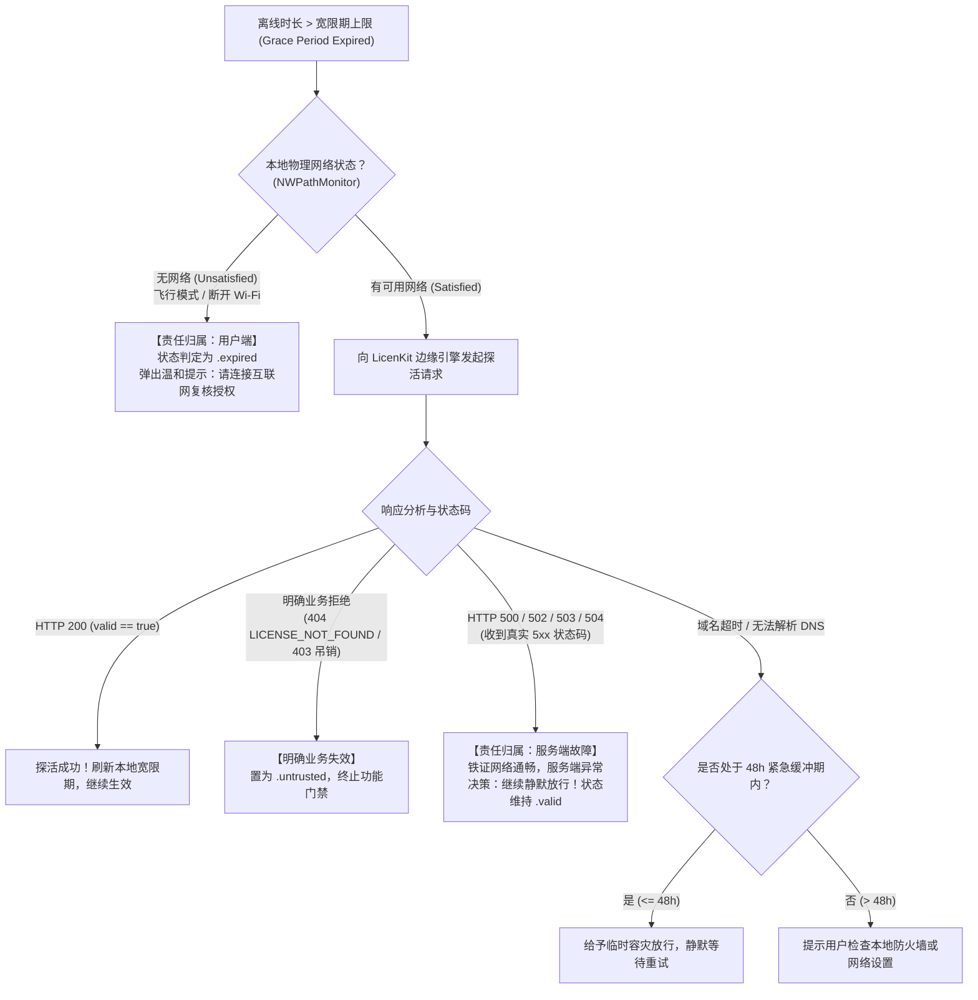

# LicenKit 客户端高可用与异常容灾架构设计规范

[English](../FAULT_TOLERANCE_AND_DISASTER_RECOVERY.md) | **简体中文**

本文档面向商业软件架构师与 SDK 集成开发者，详述 **LicenKit** 授权体系在面对网络不稳定、服务端故障（如 HTTP 404、500、502、503、504）及断网离线等各类极端场景下的高可用容灾架构、双轨重试策略与弹性降级机制。

---

## 1. 核心设计哲学与基本准则

软件授权系统运行在复杂的终端用户网络环境中。网络超时、弱网、DNS 解析失败、反向代理故障或服务端停机维护是不可避免的客观规律。为此，LicenKit 确立了以下核心容灾准则：

### 1.1 准则一：严待业务吊销，宽待系统故障 (Fail-Open on Infra, Fail-Closed on Revocation)
* **商业连续性第一**：绝对不能因为授权服务端故障或临时网络中断，导致正版付费用户被中断业务、锁死功能或弹出强阻断警报。
* **分权治理**：
  * **基础设施故障（5xx、超时、网关异常）**：采取 **Fail-Open（故障放行）** 机制，保持应用全功能可用；
  * **显式业务吊销（明确判定已退款、已过期、席位已剔除）**：采取 **Fail-Closed（严格封锁）** 机制，及时终止授权并按需清理本地凭据。

### 1.2 准则二：宽限期耗尽后的责任归属原则 (Blame-Aware Gating on Grace Expiration)
**“永远不要用服务端的故障去惩罚已经付过费的正常用户。”**  
即使本地脱网宽限期（Offline Grace Period）已经耗尽，SDK 也不得盲目直接阻断用户，而必须精细区分责任归属：
* **归属于用户端（检测到本地完全无网络）**：
  系统处于飞行模式或 Wi-Fi 断开，且已超期多日。此时弹出温和提示：*“您已脱网多日，请连接互联网以复核授权状态”*，用户完全理解并预期这一行为。
* **归属于服务端（检测到本地有网络，但返回 5xx 服务端故障）**：
  **既然能收到 HTTP 500/502/503/504，说明网络请求已经成功抵达云端，这 100% 是我们服务端的责任！** 正版付费用户不应背锅，**SDK 必须继续无条件静默放行**，绝不弹窗打扰用户正常工作。

### 1.3 准则三：离线优先与密码学自主核验 (Offline-First Cryptographic Autonomy)
* **去中心化验签**：LicenKit 采用 **Ed25519 非对称数字签名** 与 **自包含 Claims Token** 架构。
* **本地主权**：客户端通过 Keychain 持久化受信任的 License Token，冷启动与日常功能门禁主要基于本地公钥密码学校验完成（耗时 < 1ms），网络通信仅作为“状态同步与续约凭据”的辅助通道。

### 1.4 准则四：二元异常严格分类 (Bifurcated Error Taxonomy)
SDK 必须严格区分两类根本不同的错误类型：
1. **基础设施与传输层异常**：网络不可达、DNS 失败、请求超时、HTTP 5xx、非 API 格式的网关 404；
2. **业务逻辑明确否定**：服务端返回包含标准业务错误码的结构化 JSON（例如 `LICENSE_NOT_FOUND`、`MACHINE_REVOKED`）或状态响应 `valid: false`。

---

## 2. 异常分类与容灾判定矩阵

| 状态类型 | 具体现象与 HTTP 表现 | 异常根因性质 | 宽限期内处理策略 | 宽限期耗尽后处理策略 | 对本地凭据的影响 |
| :--- | :--- | :--- | :--- | :--- | :--- |
| **服务端内部错误** | HTTP `500 Internal Server Error` | 服务端边缘引擎或数据库异常 | **触发离线降级**：读取本地 Token 验签放行 | **【自身故障】继续静默放行**，绝不打扰用户 | **严禁清除**，保留凭据 |
| **网关与负载均衡故障** | HTTP `502 / 503 / 504` | 代理层宕机、服务重启或网关超时 | **触发离线降级**：放行，启动后台退避重试 | **【自身故障】继续静默放行**，绝不打扰用户 | **严禁清除**，保留凭据 |
| **非结构化网关 404** | HTTP `404 Not Found`<br>(返回 HTML 页面或 Nginx 默认页) | 域名解析错误、Base URL 配置错误或网关路由故障 | **视为基础设施配置异常**：触发离线降级 | **【配置/网关异常】继续静默放行**，控制台输出警告 | **严禁清除**，保留凭据 |
| **客户端物理断网** | 系统无可用网络、飞行模式、网线拔出 | 传输层不可达（用户端网络环境） | **触发离线降级**：放行，静默等待网络恢复 | **【用户端责任】状态转为 `.expired`**，弹窗提示连接网络 | **严禁清除**，等待连网续签 |
| **链路波动 / 域名无法解析** | 有网络，但无法连通域名 (DNS / Timeout) | 中间链路抖动，或极少数本地防火墙规则拦截 | **触发离线降级**：放行，静默等待重试 | **给予 48 小时紧急缓冲期**；若超时仍连不上才提示检查防火墙 | **严禁清除**，保留凭据 |
| **业务级实体 404** | HTTP `404 / 422`<br>(返回标准 JSON `code: "LICENSE_NOT_FOUND"`) | 许可证密钥已被后台物理删除或废弃 | **显式业务失效**：终止授权，提示许可证不存在 | **显式业务失效**：终止授权，提示许可证不存在 | **标记失效 / 清除凭据** |
| **设备席位吊销** | HTTP `200` (`valid: false`) 或<br>`code: "MACHINE_DEACTIVATED"` | 管理员在后台解绑/踢出该机器，或超过最大席位 | **显式业务失效**：终止授权，提示席位已在其他设备登录 | **显式业务失效**：终止授权，提示席位已在其他设备登录 | **标记失效 / 清除凭据** |
| **主动解绑席位** | 开发者或用户调用 `deactivate()` | 用户主动退出登录或注销当前设备 | **本地优先**：本地立即清除，向云端 Best-Effort 通知 | **本地优先**：本地立即清除，向云端 Best-Effort 通知 | **立即物理清除** |

---

## 3. “双轨制”容灾重试策略规范

针对不同交互属性的请求，SDK 实行严格分轨的退避重试机制，杜绝“全量教条式重试”带来的惊群效应（Thundering Herd / DDoS）与 UI 假死。

| 维度 | 轨道 A：前台阻塞操作 (`activate`) | 轨道 B：后台静默操作 (`validate` / 心跳) |
| :--- | :--- | :--- |
| **典型场景** | 用户手动输入激活码、手动点击“恢复购买/激活” | 应用启动时静默探活、定时后台打卡同步 |
| **界面与心理** | 前台弹窗带有 Loading 转圈，用户耐心在 10~15 秒以内 | **完全静默无感**，用户在主界面正常编辑或工作 |
| **可恢复故障 (5xx) & 超时** | **自动重试 3 次**<br>退避间隔：**2s $\rightarrow$ 4s $\rightarrow$ 8s**（注入轻微抖动） | **最多重试 1 次（共 2 次请求）**<br>第 1 次失败后，**静默等待 $\ge 60$ 秒**再试第 2 次；若仍失败，**本次打开/本 Session 彻底放弃重试** |
| **服务端限流 (429)** | **自动重试 3 次**<br>退避间隔：**4s $\rightarrow$ 8s $\rightarrow$ 16s**（Cloudflare 极少触发） | **立即中止，当天不再尝试**<br>持久化记录冷却时间戳（`rateLimitedUntil`），24 小时内直接走纯离线验签 |
| **业务明确拒绝 (404/409/422)** | **0 重试**，立刻报错并在 UI 解释原因 | **0 重试**，立即终止授权 |
| **最终失败后果** | 弹出清晰的错误提示，用户可手动点击“重试” | **无缝降级**至本地 `verifyOffline()`，用户工作完全不受影响 |

### 3.1 Mac 平台特殊边界设计
1. **Mac 长期不关机（休眠合盖）场景**：
   * 许多 Mac 用户常年合盖休眠，一个 App 进程可能持续数周。
   * **唤醒保底**：普通情况下“本次打开失败后不再尝试”；但若系统脱网时间进入紧迫阶段（已离线时间 $> 70\%$ 宽限期），或者监听到底层物理网络发生切换（`NWPathMonitor` 从离线切回在线），SDK 自动重置本 Session 失败标记，并唤醒一次静默探活。
2. **限流冷却的跨进程持久化**：
   * “本次打开不尝试”存储于内存单例中（`sessionHeartbeatBlocked = true`），App 重启自动复位；
   * “429 限流当天不尝试”通过 `UserDefaults` 持久化保存冷却截止时间戳，防止用户重启 App 导致二次冲撞限流。

---

## 4. 宽限期耗尽后的责任归属判定流程



---

## 5. 离线安全防伪边界保障

在实现最大程度故障降级放行的同时，LicenKit 依然坚守严密的反作弊安全边界：

### 5.1 本地系统时钟篡改与回拨防御 (Clock Rollback Defense)
脱网宽限期依赖系统时钟。为了防止攻击者通过故意将系统时间回拨（如改回 2020 年）来无限期享受离线宽限期：
1. **上次探活时间比对**：若系统当前时间 $T_{\text{now}} < T_{\text{lastValidated}} - 3600\text{s}$（超过 1 小时容差），立即判定为 `.untrusted` 并拦截；
2. **证书签发时间比对**：若系统当前时间 $T_{\text{now}} < T_{\text{issuedAt}} - 3600\text{s}$，判定系统时钟异常，拒绝生效。

### 5.2 硬件指纹防漂移核验 (Hardware Pinning)
即使在离线降级状态下，离线 Token 内嵌的硬件指纹与当前设备的提取指纹一致性检查依然无条件执行，严防将 Keychain 凭据拷贝到未授权机器上直接利用离线宽限期运行。

---

## 6. SDK 推荐代码架构实现

在 SDK 门面层（`LicenKit.swift`）与重试协调器（`LicenKitRetryCoordinator.swift`）中，推荐采用以下完整代码模式落地本规范：

### 6.1 重试调度协调器 (LicenKitRetryCoordinator.swift)
```swift
import Foundation
import Network

public enum RequestScenario {
    case foregroundActivation
    case backgroundSync
}

public final class LicenKitRetryCoordinator: @unchecked Sendable {
    public static let shared = LicenKitRetryCoordinator()
    
    private let pathMonitor = NWPathMonitor()
    private var isNetworkSatisfied: Bool = true
    private var sessionHeartbeatBlocked = false
    private let lock = NSLock()
    
    private init() {
        pathMonitor.pathUpdateHandler = { [weak self] path in
            guard let self = self else { return }
            self.lock.lock()
            let becameSatisfied = (path.status == .satisfied && !self.isNetworkSatisfied)
            self.isNetworkSatisfied = (path.status == .satisfied)
            if becameSatisfied {
                // 网络由断网切为连通，重置本 Session 阻断标记
                self.sessionHeartbeatBlocked = false
            }
            self.lock.unlock()
        }
        pathMonitor.start(queue: DispatchQueue.global(qos: .utility))
    }
    
    public var isOnline: Bool {
        lock.lock()
        defer { lock.unlock() }
        return isNetworkSatisfied
    }
    
    public var isRateLimitedToday: Bool {
        if let until = UserDefaults.standard.object(forKey: "LicenKit_RateLimitedUntil") as? Date {
            return Date() < until
        }
        return false
    }
    
    public func markRateLimitedForToday() {
        let tomorrow = Calendar.current.date(byAdding: .day, value: 1, to: Date()) ?? Date().addingTimeInterval(86400)
        UserDefaults.standard.set(tomorrow, forKey: "LicenKit_RateLimitedUntil")
    }
    
    /// 执行自适应双轨重试
    public func execute<T>(
        scenario: RequestScenario,
        operation: () async throws -> T
    ) async throws -> T {
        switch scenario {
        case .foregroundActivation:
            return try await executeForeground(operation)
        case .backgroundSync:
            return try await executeBackground(operation)
        }
    }
    
    // 轨道 A：前台阻塞重试 (2s -> 4s -> 8s)
    private func executeForeground<T>(_ operation: () async throws -> T) async throws -> T {
        let maxRetries = 3
        var attempt = 0
        while true {
            do {
                return try await operation()
            } catch {
                guard isRecoverable(error), attempt < maxRetries else { throw error }
                let is429 = isRateLimit(error)
                let delays = is429 ? [4.0, 8.0, 16.0] : [2.0, 4.0, 8.0]
                let delay = delays[min(attempt, delays.count - 1)] + Double.random(in: 0...0.5)
                attempt += 1
                try await Task.sleep(nanoseconds: UInt64(delay * 1_000_000_000))
            }
        }
    }
    
    // 轨道 B：后台静默探活重试 (等 60s 试一次，再失败本 Session 彻底不试)
    private func executeBackground<T>(_ operation: () async throws -> T) async throws -> T {
        lock.lock()
        let blocked = sessionHeartbeatBlocked || isRateLimitedToday
        lock.unlock()
        if blocked {
            throw LicenKitError.networkError("Background sync skipped (session blocked or rate limited)")
        }
        
        do {
            return try await operation()
        } catch {
            if isRateLimit(error) {
                markRateLimitedForToday()
                throw error
            }
            guard isRecoverable(error) else { throw error }
            
            // 失败静默等 60s 重试第 2 次
            try await Task.sleep(nanoseconds: 60 * 1_000_000_000)
            
            do {
                return try await operation()
            } catch {
                self.lock.lock()
                self.sessionHeartbeatBlocked = true
                self.lock.unlock()
                throw error
            }
        }
    }
    
    private func isRecoverable(_ error: Error) -> Bool {
        if let err = error as? LicenKitError {
            switch err {
            case .networkError: return true
            case .apiError(let code, _):
                return code.starts(with: "HTTP_5") || code == "HTTP_429"
            default: return false
            }
        }
        return false
    }
    
    private func isRateLimit(_ error: Error) -> Bool {
        if case LicenKitError.apiError(let code, _) = error { return code == "HTTP_429" }
        return false
    }
}
```

### 6.2 在线探活与责任归属降级 (LicenKit.swift)
```swift
extension LicenKit {
    
    /// 在线探活方法（内置责任归属容灾与自动降级机制）
    @discardableResult
    public func validate() async throws -> ValidationResult {
        let fingerprint = try await fingerprintProvider.getFingerprint()
        guard let creds = try credentialStore.loadCredentials(for: fingerprint) else {
            throw LicenKitError.unactivated
        }
        
        let coordinator = LicenKitRetryCoordinator.shared
        
        do {
            // 通过双轨重试协调器执行探活
            let response = try await coordinator.execute(scenario: .backgroundSync) {
                let request = ApiValidateRequest(
                    accountId: self.configuration.accountId,
                    licenseKey: creds.licenseKey,
                    fingerprint: fingerprint
                )
                return try await self.apiClient.validate(request: request)
            }
            
            // 1. 显式业务吊销：服务端判定席位失效
            if !response.valid {
                setCachedStatus(.untrusted(reason: response.reason ?? "License revoked by server"))
                return ValidationResult(valid: false, token: response.token, reason: response.reason)
            }
            
            // 2. 探活成功：刷新本地 Token 与 lastValidatedAt
            let updatedToken = (response.token?.isEmpty == false) ? response.token! : creds.token
            let updatedCreds = StoredCredentials(
                licenseKey: creds.licenseKey,
                token: updatedToken,
                lastValidatedAt: Date(),
                offlineGracePeriod: creds.offlineGracePeriod,
                policyFeatures: creds.policyFeatures,
                machineId: creds.machineId,
                isTrial: false
            )
            try credentialStore.saveCredentials(updatedCreds, for: fingerprint)
            _ = try? await verifyOffline()
            
            return ValidationResult(valid: true, token: updatedToken)
            
        } catch let error as LicenKitError {
            // 3. 业务级显式失效 -> 严格封锁
            if case .apiError(let code, _) = error, isExplicitBusinessRejection(code) {
                setCachedStatus(.untrusted(reason: "License no longer valid on server"))
                throw error
            }
            
            // 4. 基础设施/网络/5xx 错误 -> 责任归属精细判定
            let offlineStatus = try await verifyOffline()
            switch offlineStatus {
            case .valid, .inGracePeriod:
                // 宽限期内：无条件故障放行
                return ValidationResult(
                    valid: true,
                    token: creds.token,
                    reason: "Validated offline (server unavailable, within grace period)"
                )
                
            case .expired:
                // 宽限期已过：执行精细化责任归属判定
                if !coordinator.isOnline {
                    // 用户端责任：完全无网络，阻断并提示需要联网
                    throw LicenKitError.networkError("Offline grace period expired. Please connect to internet to verify license.")
                }
                
                // 用户端有网络，但收到服务端 5xx
                if case .apiError(let code, _) = error, code.starts(with: "HTTP_5") {
                    // 服务端责任：铁证自营故障，绝不惩罚用户，继续静默放行
                    return ValidationResult(
                        valid: true,
                        token: creds.token,
                        reason: "Server error encountered but user is online. Fail-open granted."
                    )
                }
                
                // 中间链路超时/无法解析域名：48 小时紧急缓冲
                return ValidationResult(
                    valid: true,
                    token: creds.token,
                    reason: "Network transient failure. Emergency 48h buffer applied."
                )
                
            case .untrusted(let reason):
                throw LicenKitError.cryptoError(reason)
            case .trial, .trialExpired:
                throw error
            }
        }
    }
    
    private func isExplicitBusinessRejection(_ code: String) -> Bool {
        let rejectionCodes: Set<String> = [
            "LICENSE_NOT_FOUND", "LICENSE_REVOKED", "LICENSE_SUSPENDED",
            "MACHINE_REVOKED", "MACHINE_DEACTIVATED", "MAX_MACHINES_REACHED"
        ]
        return rejectionCodes.contains(code)
    }
}
```

---

## 7. 宿主应用集成推荐实践

1. **App 启动冷启动**：
   优先直接调用 `try await LicenKit.shared.verifyOffline()`。本地验签耗时极短（< 1ms），无网络阻塞，应用秒开进入主界面。
2. **后台异步探活**：
   应用启动进入主界面后，在后台异步任务中调用 `_ = try? await LicenKit.shared.validate()`，由 SDK 内部负责联网、自动刷新 Token 或在服务器故障时静默降级。
3. **状态响应与通知**：
   宿主应用仅需监听 `LicenKit.shared.cachedStatus`：
   * 遇到 `.inGracePeriod`：在设置界面温和展示网络连接提示；
   * 遇到 `.expired`：弹出友好的“请连接互联网以复核授权”提示弹窗；
   * 避免对单次网络失败直接弹出全屏报错模态框。
