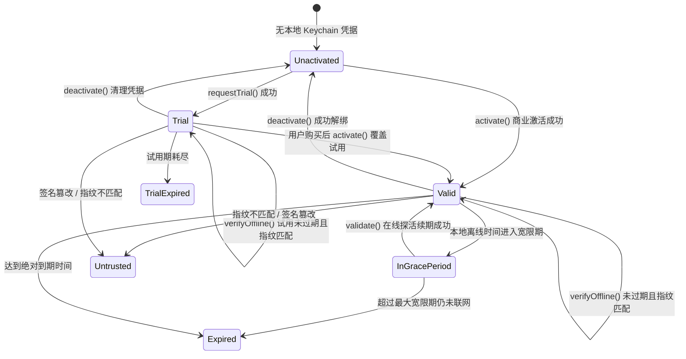

# LicenKit Swift SDK 功能与模块设计规范

[English](../MODULES_AND_FEATURES.md) | **简体中文**

本文档面向工程开发与 SDK 维护者，详细定义 **LicenKit Swift SDK** (`licenkit-sdk-swift`) 各功能模块的职责边界、数据结构以及内部交互逻辑。

> [!NOTE]
> **设计范围界定**：本 SDK 一期采用 **Headless（纯无界面 API）** 设计原则，不包含任何内置 UI 界面或弹窗视图，仅提供纯粹、强类型、线程安全的底层能力与业务状态接口。

---

## 模块全景图

| 模块名称 | 所在目录 | 职责与核心特性 | 依赖库 |
| :--- | :--- | :--- | :--- |
| **Facade & Client** | `Sources/LicenKit/` | 全局单例/多实例入口、生命周期调度、对外公开 API | `Foundation` |
| **Crypto Core** | `Sources/LicenKit/Crypto/` | Ed25519 签名验证、Base64URL 编解码、Token 业务判定 | `CryptoKit` |
| **Platform Device** | `Sources/LicenKit/Platform/` | 硬件特征抽象、macOS IOKit `IOPlatformUUID` 提取与回退 | `IOKit` (仅 macOS) |
| **Network Client** | `Sources/LicenKit/Network/` | 与 LicenKit 服务端边缘 API 通信 (`URLSession`) | `Foundation` |
| **Storage & Security** | `Sources/LicenKit/Storage/` | 本地安全凭据存储、Keychain 隔离与持久化 | `Security` |
| **Models & Errors** | `Sources/LicenKit/Models/` | 状态机枚举、Token Claims 模型、错误码分类 | `Foundation` |

---

## 1. 模块 1：Client Facade & Configuration

### 1.1 职责
- 作为宿主应用接入 SDK 的唯一入口。
- 维护客户端运行时上下文（配置项、当前内存中的验证状态缓存、后台静默心跳任务）。
- 协同管理各底层子模块的依赖注入。

### 1.2 核心类型与数据流
- `LicenKitConfiguration`：不可变配置结构体。
  - `serverUrl`: LicenKit 服务端边缘实例基础地址。
  - `accountId`: 商户/工作区唯一识别码。
  - `productId`: 软件产品 ID。
  - `publicKey`: 产品的 Ed25519 公钥（支持 32 字节原始 Base64 或 SPKI 格式）。
  - `timeoutInterval`: 统一网络超时时间。
- `LicenKit`：公开门面类，遵循 Swift Concurrency 线程安全标准（`Sendable`）。

---

## 2. 模块 2：Crypto Core & 离线密码学

### 2.1 职责
- 实现纯离线、零外部依赖的 Ed25519 椭圆曲线数字签名验证。
- 解析 JWT-like 三段式结构的 License Token 与 Trial Token (`Header.Payload.Signature`)。
- 执行离线业务规则判定（有效期校验、机器指纹比对、特性权限过滤、时钟回退与漂移防伪）。

### 2.2 核心组件
1. **`Ed25519Verifier`**：
   - 兼容 Raw 32-Byte Base64 与 Standard SPKI 格式公钥。
   - `verifyAndDecodeAnyToken`：先核验 Ed25519 数学签名，再自适应分发解码为 `LicenseClaims` 或 `TrialClaims`。
2. **`ClaimsEvaluator`**：
   - `evaluate(claims:...)`：评估商业版授权有效性、宽限期与时钟状态；
   - `evaluateTrial(claims:...)`：评估试用期有效性、到期拦截与指纹防伪。

---

## 3. 模块 3：Platform & Device Fingerprint (硬件指纹)

### 3.1 职责
- 提取宿主机器不可篡改的全局唯一硬件特征，杜绝 License 扩散。
- 建立多端隔离架构，一期提供完整的 macOS 原生硬件指纹提取与高可用回退。

### 3.2 macOS 原生提取逻辑 (`MacOSFingerprintProvider`)
1. **主选通道（内核 IOKit 原生属性）**：
   ```text
   IOServiceMatching("IOPlatformExpertDevice")
   -> IORegistryEntryCreateCFProperty(kIOPlatformUUIDKey)
   -> CFString 转换并格式化为标准 UUID 字符串
   ```
2. **安全降级回退（Deterministic Network Fallback）**：
   - 若 IOKit 受限，通过 `getifaddrs` 读取非回环物理网卡 MAC 地址 + Hostname；
   - 执行 `CryptoKit.SHA256` 计算哈希摘要，保证指纹始终稳定一致。

---

## 4. 模块 4：Network & Cloudflare API 交互

### 4.1 职责
- 封装基于 `URLSession` 的现代异步网络客户端。
- 严格遵从 LicenKit 服务端 RESTful API 契约协议。
- 统一处理网络错误、超时与 HTTP 状态码映射。

### 4.2 接口对接矩阵

| API 动作 | 请求路径 | 方法 | 核心参数 | 响应数据 |
| :--- | :--- | :--- | :--- | :--- |
| **试用认领** | `/api/v1/client/trial` | `POST` | `account_id`, `product_id`, `fingerprint` | 试用认领结果、签名 Token、开放特性 |
| **激活席位** | `/api/v1/client/activate` | `POST` | `account_id`, `license_key`, `fingerprint`, `platform` | 席位 ID、签名 Token、策略信息 |
| **心跳探活** | `/api/v1/client/validate` | `POST` | `account_id`, `license_key`, `fingerprint` | 是否有效、最新 Token、过期时间 |
| **解绑席位** | `/api/v1/client/deactivate` | `POST` | `account_id`, `license_key`, `fingerprint` | 解绑确认状态 |
| **拉取公钥** | `/api/v1/client/products/:id/pubkey` | `GET` | `accountId` (Query) | 产品活跃公钥、算法、Key ID |

---

## 5. 模块 5：Storage & Keychain 安全持久化

### 5.1 职责
- 安全持久化授权与试用核心凭据，包括：
  - 用户激活码 (`license_key`)；
  - 离线验签 Token (`token`)；
  - 上次成功在线校验时间戳与离线宽限期；
  - 试用标记 (`isTrial`)。
- 杜绝本地用户修改明文文件伪造授权。

### 5.2 安全机制 (`KeychainStore`)
- 使用 Apple 系统级 **Keychain Services** (`kSecClassGenericPassword`)；
- `kSecAttrService` = `"com.licenkit.client.<productId>"` 隔离不同产品；
- `kSecAttrAccessibleAfterFirstUnlock` 支持后台开机自启静默读取；
- `roaming_license_key` 支持 iCloud Keychain 自动多设备同步。

---

## 6. 模块 6：运行态许可证状态机 (License State Machine)



- **`valid(claims: LicenseClaims)`**：商业版完全有效。
- **`trial(claims: TrialClaims)`**：免费试用期内有效。
- **`inGracePeriod(claims: LicenseClaims, remainingSeconds: TimeInterval)`**：脱网宽限期中，允许用户离线使用。
- **`expired`**：商业授权到期。
- **`trialExpired`**：免费试用期结束。
- **`untrusted(reason: String)`**：凭据存在签名损坏、硬件指纹跨机器篡改等安全异常。
- **`unactivated`**：本地尚未录入任何凭据。
